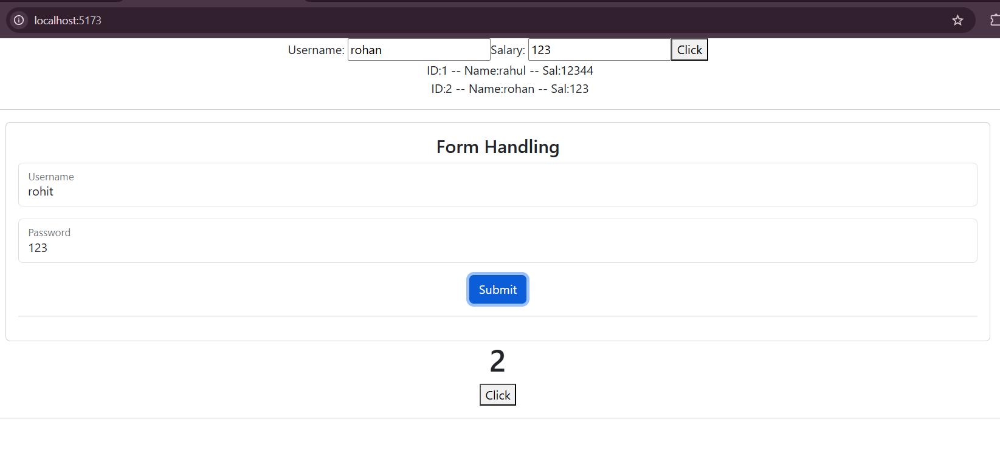

# React Session 3 Practice

This project is built using **React + Vite** to practice fundamental React concepts such as state management, form handling, dynamic list rendering, and the `useEffect` hook.

---

# 📚 Concepts Covered

- React Functional Components
- useState Hook
- useEffect Hook
- Controlled Components
- Form Handling
- Dynamic Array Rendering
- Event Handling
- Bootstrap Integration

---

# 🛠️ Technologies Used

- React
- Vite
- JavaScript (ES6+)
- Bootstrap 5
- HTML5
- CSS3

---

# 📁 Project Structure

```text
session3_practice
│
├── public
├── src
│   ├── assets
│   ├── components
│   │      ├── FormHandling.jsx
│   │      ├── UseEffect_ex.jsx
│   │      └── UseState_arr.jsx
│   │
│   ├── screenshots
│   │      ├── Home1.png
│   │      ├── submit.png
│   │
│   │
│   ├── App.jsx
│   ├── App.css
│   ├── main.jsx
│   └── index.css
│
├── package.json
├── vite.config.js
└── README.md
```

---

# 📸 Project Screenshots

## 1️⃣ Dynamic Array Rendering using useState

Users can enter an employee's **Name** and **Salary**. When the **Click** button is pressed, a new employee object is added to the array and displayed dynamically using the `map()` function.

### Features

- Dynamic array creation
- Add employee records
- Render list using `map()`
- Unique `key` for each list item


---

## 2️⃣ Form Handling using useState

A simple login form created using controlled components.

### Features

- Username input
- Password input
- Controlled form elements
- Prevent page reload using `preventDefault()`
- Display welcome message using `alert()`


---

## 3️⃣ useEffect Hook Example

This example demonstrates how the `useEffect` hook performs side effects in React.

Whenever the counter value changes, the browser tab title updates automatically.

### Example

```jsx
useEffect(() => {
    document.title = `Count is: ${count}`;
}, [count]);
```

Example Browser Title:

```
Count is: 2
```

---

# 🚀 Getting Started

## Clone the Repository

```bash
git clone https://github.com/rc720/Session3_Pract.git
```

---

## Navigate to the Project

```bash
cd session3_practice
```

---

## Install Dependencies

```bash
npm install
```

---

## Run the Development Server

```bash
npm run dev
```

Open your browser and visit:

```
http://localhost:5173
```

---

# 🎯 Learning Outcomes

After completing this project, you will understand:

- Managing state with `useState`
- Updating arrays in React state
- Rendering dynamic lists using `map()`
- Creating controlled forms
- Handling form submission
- Preventing default browser behavior
- Using the `useEffect` hook
- Updating the browser tab title dynamically
- Integrating Bootstrap into React applications

---

# 👨‍💻 Author

**Rahul Chaurasiya**

GitHub: https://github.com/rc720

---

⭐ If you found this project helpful, consider giving it a **Star** on GitHub.